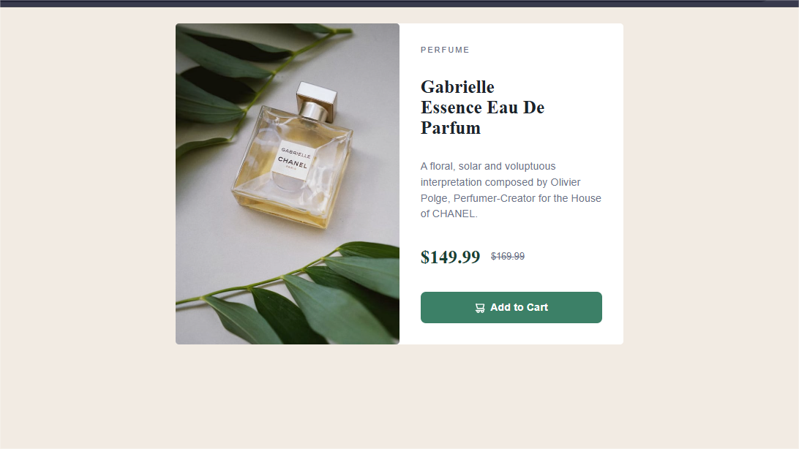

# Frontend Mentor - Product Preview Card Component Solution

This is my solution to the [Product preview card component challenge on Frontend Mentor](https://www.frontendmentor.io/challenges/product-preview-card-component-GO7UmttRfa). This challenge helped reinforce responsive layouts, semantic HTML, and custom styling using CSS variables.

## Table of contents

* [Overview](#overview)

  * [The challenge](#the-challenge)
  * [Screenshot](#screenshot)
  * [Links](#links)
* [My process](#my-process)

  * [Built with](#built-with)
  * [What I learned](#what-i-learned)
  * [Continued development](#continued-development)
  * [Useful resources](#useful-resources)
* [Author](#author)

---

## Overview

### The challenge

Users should be able to:

* View the component in both mobile and desktop layouts
* See hover and focus states for interactive elements (like the button)

### Screenshot




### Links

* 🔗 **Solution URL:** [GitHub Repo](https://github.com/Bensolve/product-preview-card-component-main)
* 🌐 **Live Site URL:** [Live Demo on Netlify](https://product-preview-card-component-main-s.netlify.app)

---

## My process

### Built with

* Semantic **HTML5**
* **CSS Custom Properties** (variables)
* **Flexbox** for layout
* **Mobile-first responsive design**
* Vanilla CSS following [Kevin Powell's CSS methodology](https://www.kevinpowell.co)
* Deployed on **Netlify**

### What I learned

* Structuring a card layout that adapts cleanly between mobile and desktop using flexbox
* Using `aspect-ratio`, `object-fit`, and `gap` for consistent image and layout spacing
* How `font-family`, `line-height`, and `padding` affect visual rhythm
* How to use **CSS custom properties** for a scalable color and typography system

```css
:root {
  --green-500: hsl(158, 36%, 37%);
  --font-heading: 'Fraunces', serif;
}
```

```html
<h1 class="card__title">Gabrielle Essence Eau De Parfum</h1>
```

```css
.card__button:hover {
  background-color: var(--green-700);
}
```

### Continued development

In future projects, I want to:

* Explore `clamp()` and fluid typography
* Improve layout decisions using `grid` where it makes more sense than `flex`
* Practice debugging responsiveness faster with devtools and emulators

### Useful resources

* [Kevin Powell – Learn CSS](https://www.kevinpowell.co) – for mobile-first, layered design thinking
* [Frontend Mentor](https://www.frontendmentor.io) – great real-world challenges
* [MDN Web Docs](https://developer.mozilla.org/) – always my go-to for CSS and layout clarifications

---

## Author

* GitHub – [@Bensolve](https://github.com/Bensolve)
* Frontend Mentor – [@Bensolve](https://www.frontendmentor.io/profile/Bensolve)
* Twitter – [@yourusername](https://x.com/Benjaminkissa1)

